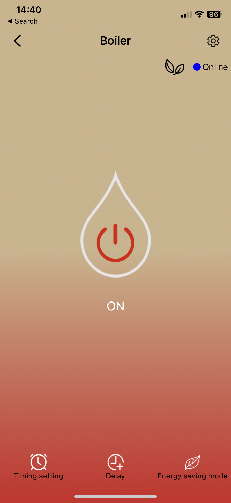
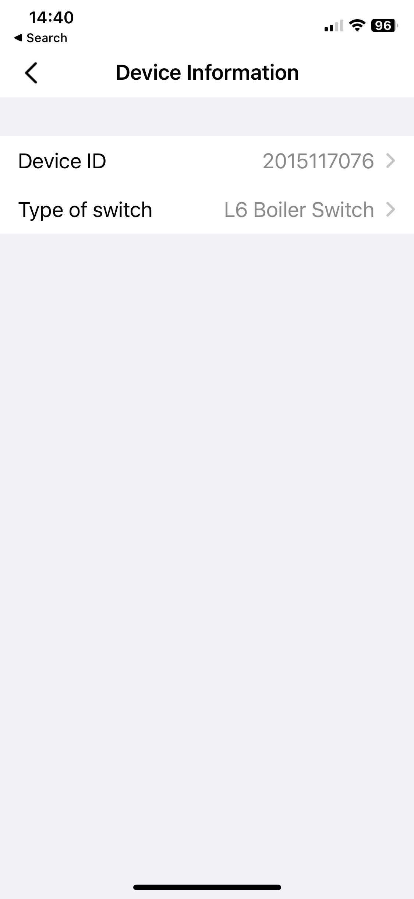

# How to Use
Change the "DEVICE_ID" and "DEVICE_TYPE" in switch_control.py and run -

```
$ python3 switch_control.py on
Boiler Switch Turned On.

$ python3 switch_control.py off
Boiler Switch Turned Off.
```


# Introduction  
The Lanbon WiFi boiler switch is a device that allows users to turn their boiler on or off, and check the status of their boiler. 
The device can be controlled using a smartphone app, making it easy to use and accessible from any device with an internet connection. The Lanbon WiFi boiler switch is typically installed by a professional and requires a WiFi connection to operate.\
A few months ago, my old Tuya Smart Boiler WiFi Switch malfunctioned and I needed to find a quick replacement. I went to the nearest Home-Center store and came across the Lanbon WiFi boiler switch.\
The installation process was relatively simple - I just had to download the SmartLiving+ app, connect the switch to my WiFi network, and everything seemed to work.\
However, I wanted to find a way to control the switch from my computer so that I could integrate it into my smart home routines.


# The Research
One of my main goals during my research was to find a way to control the Lanbon WiFi boiler switch from my computer; Yet, my search for an API or a Python wrapper online yielded no results. 

I set out to examine the methods used to communicate with the Lanbon WiFi boiler switch. I wanted to understand how the mobile app was able to send commands to the switch and identify any potential vulnerabilities in the communication methods.


## "SmartLiving+" App  

To conduct my research, I first focused on the SmartLiving+ app. I wanted to see if there was any useful information or insights that I could gather from the app that might be helpful in my research.

In my evaluation of the SmartLiving+ app, I found it to be somewhat lacking in terms of design and functionality. Personally, I didn't think it looked particularly good and encountered several bugs while using it.

Despite these issues, the app does offer a relatively straightforward process for setting up a new device, such as the Lanbon WiFi boiler switch. To add a new device, I simply needed to click the plus button in the top right corner of the app and select the correct type of device. The app then searched for nearby Lanbon devices and allowed me to connect and set them up.

After setting up the Lanbon WiFi boiler switch in the SmartLiving+ app, I was able to access the device information such as the device ID and type of switch. This information was helpful in understanding the characteristics of the device and how it was configured.

<p align="center">


</p>


## Port Scanning  

Next, I focused on understanding the network configuration of the switch. I scanned the network to find the IP address of the switch and used nmap to scan the ports of the WiFi switch. This revealed that port 80 was open on the switch. 

```
Starting Nmap 7.93 ( https://nmap.org ) at 2022-12-30 13:03 IST
Nmap scan report for 192.168.1.11
Host is up (0.032s latency).
Not shown: 999 closed tcp ports (reset)
PORT   STATE SERVICE VERSION
80/tcp open  http    Contiki/2.6
| http-auth:
| HTTP/1.0 401 Unauthorized\x0D
|_  Basic realm=USER LOGIN
|_http-title: 401 Unauthorized
|_    Content-type: text/html
...
MAC Address: DD:DD:DD:DD:DD:DD (Shanghai High-Flying Electronics Technology)
Device type: switch|media device
Running (JUST GUESSING): Cisco embedded (88%), HP embedded (88%), Acer embedded (85%)
OS CPE: cpe:/h:cisco:slm2008 cpe:/h:hp:procurve_1800
Aggressive OS guesses: Cisco SLM2008 or HP ProCurve 1800 switch (88%), Acer S5200 projector (85%)
No exact OS matches for host (test conditions non-ideal).
Network Distance: 1 hop

TRACEROUTE
HOP RTT      ADDRESS
1   31.98 ms 192.168.1.11

```

Upon accessing the website hosted on the switch through port 80, I was presented with a login page promoting a user and password, my first guess was "admin" for both. Boom. I was in.

<p align="center">


</p>

I was able to use these login credentials to access the website and control various settings on the switch, such as changing network connection settings, setting the work mode, restoring and restarting the device, and viewing device information. However, I was unable to find an option to control the state of the switch, specifically to turn it on or off.

## Network Sniffing  

Next, I focused on analyzing the network traffic generated by the mobile app when it sends commands to the switch. I used Wireshark to capture and analyze the network traffic between the mobile app and the switch.

I noticed that the app was sending requests to two public addresses using the MQTT protocol, which is commonly used for transferring telemetry data.
In the packet itself I was able to see the username and password used to connect to the MQTT server, which was "lanbon" and "lanbon2019" respectively. I was able to connect to both of these addresses, but I didn't explore this further.

I also noticed that some of the requests were being broadcasted to the local network on port 8866. In an effort to "force" the switch to communicate with the mobile app through the local network, I disconnected the router from the internet.

Upon analyzing the network traffic, I was able to see the data that was being transmitted broadcastly, and noticed patterns that indicated how the mobile app was sending commands to the switch. Further examination revealed that the app was using UDP to send commands broadcastly to which the switch responded with some sort of confirmation message 33 bytes long.

This is how the 'Turn On' command looked - 
```
0000   aa 21 a0 10 45 20 15 11 70 76 1f 01 00 21 a0 10
0010   00 00 00 00 00 00 00 00 00 00 00 00 00 00 00 00
0020   00
```

And this is how the 'Turn Off' command looked - 
```
0000   aa 21 a0 10 44 20 15 11 70 76 1f 00 00 21 a0 10
0010   00 00 00 00 00 00 00 00 00 00 00 00 00 00 00 00
0020   00
```

Easy to notice the Device ID found from examine the mobile application earlier - 2015117076\
So I started to to analyze the data and noticed - \
The first 4 bytes of the data were always the same - ```aa 21 a0 10```, which I assumed was the header.\
The next byte was either ```45``` or ```44```, which I assumed was the command to turn the switch on or off.\
The next 4 bytes were the ```Device ID```.\
The next byte was the ```Device Type```.\
The next byte was either ```01``` or ```00```, which I assumed was the command to turn the switch on or off.\
The next 4 bytes were ```00 21 a0 10```, which I assumed was the footer.\
The next 17 bytes were always ```00```, which seemed to be padding.

Now I had a pretty good idea of how the app was sending commands to the switch. I was able to use this information to create a Python script that could send commands to the switch. I was able to use this script to turn the switch on and off.

Later on, I came across Jan Newmarch's book "Internet of Things - a techie's viewpoint" and noticed that it contained a chapter on Lanbon switches. This provided me with additional information and helped confirm my findings. If you are interested in learning more about IoT devices, I recommend reading this book (it's free, link in the resources section).
## Conclusion

One of the key vulnerabilities I took advantage of in this project was the fact that when the switch communicates with the mobile app through the local network - the network traffic is not encrypted. This meant that an attacker with access to the same WiFi network could potentially intercept and manipulate the commands being sent to the switch. This could allow an attacker to gain unauthorized control over the switch and potentially disrupt the operation of the boiler.

## Disclaimer

Notice - This script is not intended to be used maliciously. I am not responsible for any damage caused by the use of this script.
This script is for educational purposes only.
This script is not production ready, it is not secure and it is not optimized. It is just a proof of concept. But it is good enough to get the job done for me.
I'm now able to control the switch from my computer, just like I wanted to.

## Resources 📝  
* [Lanbon home page](http://www.lanbon.cn/)
* ["Internet of Things - a techie's viewpoint" - Jan Newmarch - Chapter 37 ](https://jan.newmarch.name/IoT/Home/Lanbon/)

# Authors

- [@AlonMoradov](https://www.github.com/AlonMoradov)
